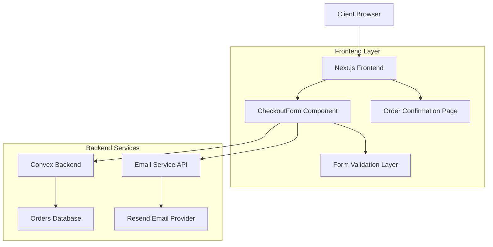

# Design Document

## Overview

The Checkout System is a comprehensive e-commerce solution that handles the complete order processing workflow for the Audiophile platform. The system integrates form validation, order persistence, email notifications, and order confirmation display while maintaining pixel-perfect design fidelity across all devices.

The architecture leverages Next.js 13+ with React Server Components, Convex for backend data storage, Resend for email delivery, and React Hook Form with Zod for robust form validation. The system is designed to handle edge cases gracefully while providing an accessible and responsive user experience.

## Architecture

### High-Level Architecture



### Component Architecture

The system follows a modular component architecture with clear separation of concerns:

- **CheckoutForm**: Main form component handling user input and validation
- **Order Confirmation Page**: Displays order summary and confirmation details
- **Email Template**: Responsive HTML email template for order confirmations
- **Cart Context**: Manages cart state and provides cart operations
- **Validation Layer**: Zod schemas for comprehensive form validation
- **API Routes**: Next.js API routes for email sending and order processing

### Data Flow

1. **Form Submission**: User completes checkout form with validation feedback
2. **Order Processing**: Form data is validated and order is created in Convex
3. **Email Notification**: Confirmation email is sent via Resend API
4. **Order Storage**: Order data is temporarily stored in sessionStorage for confirmation page
5. **Confirmation Display**: User is redirected to confirmation page with order details
6. **Cart Cleanup**: Cart is cleared after successful order completion

## Components and Interfaces

### CheckoutForm Component

**Purpose**: Primary checkout interface handling user input, validation, and order submission.

**Key Features**:
- Multi-section form layout (Billing, Shipping, Payment)
- Real-time validation with inline error messages
- Payment method selection (e-Money vs Cash on Delivery)
- Order summary sidebar with cart items and totals
- Accessibility compliance with ARIA labels and screen reader support
- Responsive design matching Figma specifications

**Props Interface**:
```typescript
// No props required - uses cart context and internal state
```

**State Management**:
- Form state managed by React Hook Form
- Cart data from CartContext
- Loading and error states for submission feedback
- Payment method conditional rendering

### Order Confirmation Page

**Purpose**: Displays comprehensive order confirmation after successful checkout.

**Key Features**:
- Order details retrieval from sessionStorage
- Complete order summary with items, pricing, and customer details
- Responsive layout with success indicators
- Fallback handling for missing order data
- Navigation back to home page

**URL Parameters**:
```typescript
interface ConfirmationParams {
  orderId: string // Order ID from successful checkout
}
```

### Email Template System

**Purpose**: Sends responsive, branded order confirmation emails.

**Template Features**:
- Responsive HTML design matching brand guidelines
- Dynamic content injection for order details
- Professional layout with clear information hierarchy
- Support contact information and CTA buttons
- Cross-email-client compatibility

**Email Data Interface**:
```typescript
interface EmailData {
  email: string
  name: string
  orderId: string
  items: CartItem[]
  total: number
  shipping: number
  subtotal: number
  tax: number
  address: string
  city: string
  country: string
  zipCode: string
}
```

### Convex Backend Schema

**Orders Table Structure**:
```typescript
interface Order {
  customerName: string
  email: string
  phone: string
  address: string
  city: string
  zipCode: string
  country: string
  paymentMethod: 'e-money' | 'cash'
  items: OrderItem[]
  subtotal: number
  shipping: number
  tax: number
  total: number
  status: 'pending' | 'completed'
  orderId: string
  createdAt: number
}

interface OrderItem {
  id: number
  name: string
  price: number
  quantity: number
  image: string
}
```

## Data Models

### Form Validation Schema

The system uses Zod for comprehensive form validation with the following schema:

```typescript
const checkoutSchema = z.object({
  // Customer Information
  name: z.string().min(1, 'Name is required').min(2, 'Name must be at least 2 characters'),
  email: z.string().email('Invalid email address'),
  phone: z.string()
    .min(1, 'Phone number is required')
    .regex(/^\+?[\d\s-()]+$/, 'Invalid phone number format'),
  
  // Shipping Address
  address: z.string().min(1, 'Address is required').min(5, 'Address must be at least 5 characters'),
  city: z.string().min(1, 'City is required').min(2, 'City must be at least 2 characters'),
  zipCode: z.string()
    .min(1, 'ZIP code is required')
    .regex(/^[\dA-Z\s-]+$/i, 'Invalid ZIP code format'),
  country: z.string().min(1, 'Country is required').min(2, 'Country must be at least 2 characters'),
  
  // Payment Information
  paymentMethod: z.enum(['e-money', 'cash'], {
    required_error: 'Please select a payment method',
  }),
  eMoneyNumber: z.string().optional(),
  eMoneyPIN: z.string().optional(),
})
```

### Order Calculation Logic

**Pricing Structure**:
- Subtotal: Sum of all cart item prices × quantities
- Shipping: Fixed $50 fee
- Tax: 20% of subtotal (VAT)
- Total: Subtotal + Shipping + Tax

**Order ID Generation**:
- Format: `ORD-{timestamp}-{random-string}`
- Example: `ORD-1699123456789-ABC123DEF`

## Error Handling

### Form Validation Errors

**Client-Side Validation**:
- Real-time validation on field blur
- Inline error messages with accessibility support
- Form submission prevention until all errors resolved
- Visual error indicators (red borders, error icons)

**Validation Error Types**:
- Required field validation
- Format validation (email, phone, ZIP code)
- Length validation (minimum character requirements)
- Conditional validation (e-Money fields when selected)

### API Error Handling

**Order Creation Errors**:
- Network connectivity issues
- Convex backend unavailability
- Invalid data submission
- Duplicate order prevention

**Email Delivery Errors**:
- Resend API failures
- Invalid email addresses
- Rate limiting issues
- Template rendering errors

**Error Recovery Strategies**:
- Graceful degradation for non-critical failures
- User-friendly error messages
- Retry mechanisms for transient failures
- Fallback confirmation display even if email fails

### Edge Case Handling

**Empty Cart Protection**:
- Prevent checkout with empty cart
- Redirect to shopping pages
- Clear error messaging

**Session Management**:
- Handle browser refresh during checkout
- Maintain form data during navigation
- Clean up temporary order data

**Duplicate Submission Prevention**:
- Disable submit button during processing
- Loading states and progress indicators
- Server-side duplicate detection

## Testing Strategy

### Unit Testing

**Form Validation Testing**:
- Test all Zod schema validation rules
- Verify error message accuracy
- Test conditional validation logic
- Validate form state management

**Component Testing**:
- Test form rendering and interaction
- Verify accessibility attributes
- Test responsive behavior
- Validate error state display

**Utility Function Testing**:
- Order calculation logic
- Order ID generation
- Email template rendering
- Data transformation functions

### Integration Testing

**Checkout Flow Testing**:
- End-to-end form submission
- Order creation in Convex
- Email sending verification
- Confirmation page display

**API Endpoint Testing**:
- Email API route functionality
- Error response handling
- Data validation on server
- Rate limiting behavior

**Cross-Browser Testing**:
- Form functionality across browsers
- Email template rendering
- Responsive design validation
- Accessibility compliance

### Accessibility Testing

**Screen Reader Compatibility**:
- ARIA label verification
- Error announcement testing
- Navigation flow validation
- Semantic HTML structure

**Keyboard Navigation**:
- Tab order verification
- Focus management
- Keyboard-only form completion
- Skip link functionality

**Visual Accessibility**:
- Color contrast validation
- Text scaling support
- High contrast mode compatibility
- Focus indicator visibility

### Performance Testing

**Form Performance**:
- Validation speed testing
- Large cart handling
- Memory usage optimization
- Bundle size analysis

**Email Delivery Performance**:
- Template rendering speed
- API response times
- Concurrent request handling
- Error recovery timing

## Security Considerations

### Data Protection

**Form Data Security**:
- Client-side validation only for UX (server validation required)
- Sensitive data handling (payment information)
- HTTPS enforcement for all communications
- Input sanitization and validation

**Email Security**:
- Template injection prevention
- Recipient validation
- Rate limiting for email sending
- Secure API key management

### Privacy Compliance

**Data Storage**:
- Minimal data retention in sessionStorage
- Secure order data storage in Convex
- Customer data protection measures
- GDPR compliance considerations

**Third-Party Integrations**:
- Resend API security compliance
- Convex data encryption
- Secure environment variable management
- API key rotation policies

## Responsive Design Implementation

### Breakpoint Strategy

**Mobile First Approach**:
- Base styles for mobile (320px+)
- Tablet enhancements (768px+)
- Desktop optimizations (1024px+)
- Large screen adaptations (1440px+)

**Layout Adaptations**:
- Single column on mobile
- Two-column layout on tablet/desktop
- Flexible grid system
- Touch-friendly interactive elements

### Design System Compliance

**Typography**:
- Consistent font families and weights
- Responsive font scaling
- Proper line height and spacing
- Accessibility-compliant contrast ratios

**Color Scheme**:
- Primary brand colors (#D87D4A)
- Neutral color palette
- Error state colors (#FF0000)
- Success state indicators

**Spacing and Layout**:
- Consistent margin and padding scales
- Grid-based layout system
- Responsive spacing adjustments
- Component spacing standards

## Performance Optimization

### Code Splitting

**Component Lazy Loading**:
- Confirmation page code splitting
- Email template optimization
- Conditional component loading
- Bundle size minimization

### Data Optimization

**Form State Management**:
- Efficient re-render prevention
- Optimized validation triggers
- Minimal state updates
- Memory leak prevention

**Image Optimization**:
- Next.js Image component usage
- Responsive image loading
- Cart item image optimization
- Lazy loading implementation

### Caching Strategy

**Static Asset Caching**:
- CSS and JavaScript caching
- Image asset optimization
- CDN utilization
- Browser cache optimization

**API Response Caching**:
- Order data caching strategies
- Email template caching
- Convex query optimization
- Session storage management